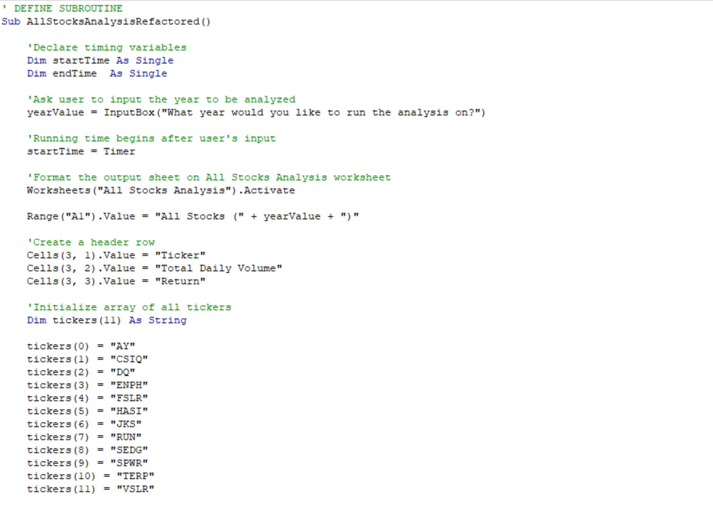
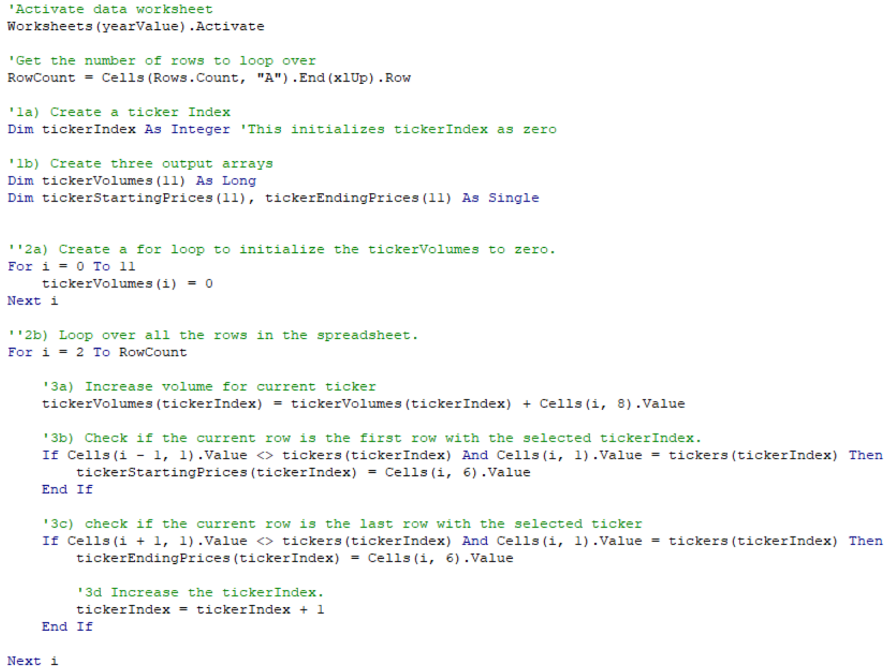
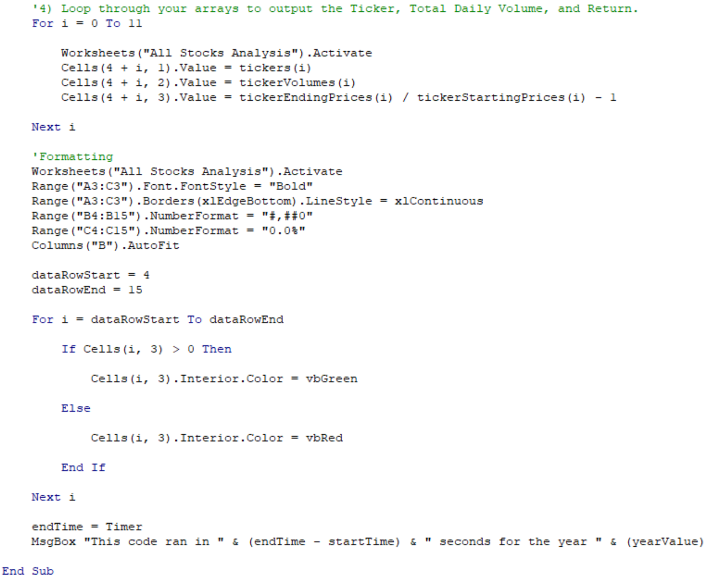

<!-- Below is an image:
|  | 
|:--:| 
| *Image Foot Note* |

*image_caption* -->

# Stock Analysis with VBA

## Overview of the Project
In this exercise, *Visual Basic Applications* *(VBA)* were used to create an *Excel Macro* to help our friend Steve analyze the stock market behaviour of twelve different green energy companies.

The purpose of this project named *VBA Challenge*, is to measure the performance of the stocks from twelve green energy companies during 2017 and 2018. Their performance is measured by determining the total daily number of shares traded (total daily volume) and the percentage of increase or decrease of the stock price at the end of a year with respect to the beginning of the same year, i.e., the yearly return.

Using the *Visual Basic Editor*, lines of code were written to build subroutines (or in a more general programming sense, scripts) for tasks automation. Task automation is important when dealing with big amounts of data, specially when the analysis of the data involves conducting repetitive tasks, as it normally is the case. Task automation also reduces execution times and the risk of human error.   

Finally, a modification to the original code was conducted to make it more efficient and to reduce its execution time. This was achieved by performing a full analysis of all the data for a specific year in a single code run. This is known as **refactoring** the code.   

## Results

### Code
Before jumping into the results, below is a brief review of the *VBA Challenge Macro*.  The code consists of three main sections:

1. Here the subroutine name is defined, initialize some variables which will later be used to measure the execution time of the code, request the user to input the year to be analyzed, specify and format the worksheet where we will be dumping our results and define an array containing the names of the stock companies. 

*Image1. VBA Challenge Excel Macro: Section 1*

2. This section is the core of the analysis. First, based on the user input, a specific worksheet containing the data is activated, then some variables used during the execution of the **for loop** as well as some arrays that will hold the results are declared. Inside the for loop the code iterates through each row of data and a series of **if conditionals** are defined, intended to stablish rules for the computation of the Total Daily Volume and the Yearly Return for each of the stock companies listed in the array declared in the first section.

*Image2. VBA Challenge Excel Macro: Section 2*

3.  This last section is intended to output and to format the results for a more user friendly display. The performance of the code is measured at this point and a pop-up message with the execution time is set to be displayed to the user.

<!-- *Image3. VBA Challenge Excel Macro: Section 3* -->

    markdown color font styles

### Stock Performance
Compare the stock performance between 2017 and 2018

### Execution Times
Compare execution times between original script and refactored script

## Summary
1. What are the advantages or disadvantages of refactoring code?
2. How do these pros and cons apply to refactoring the original VBA script?
