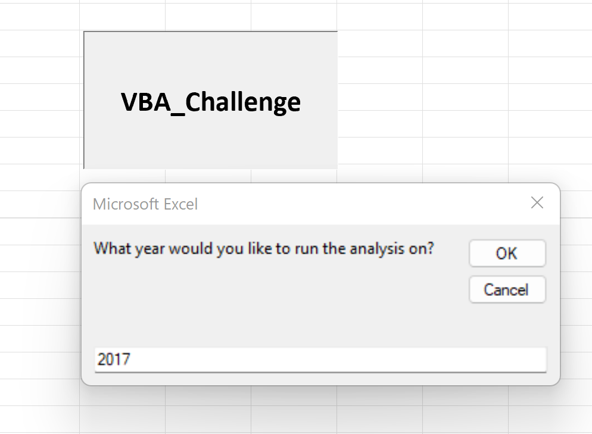
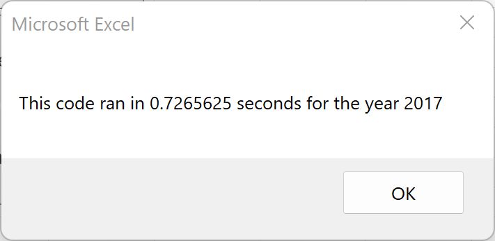
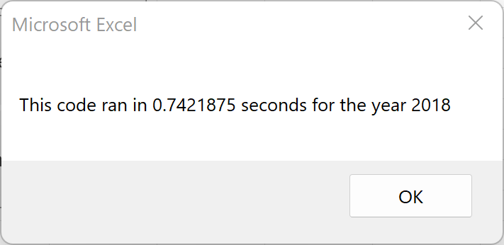
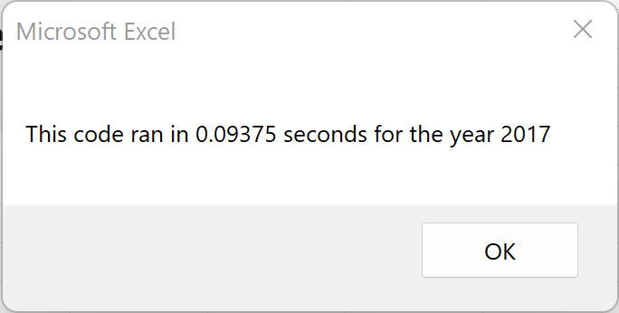
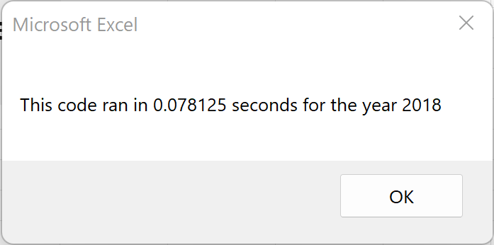

# Stock Analysis with VBA

## Overview of the Project
In this exercise, *Visual Basic Applications* *(VBA)* were used to create an *Excel Macro* to help our friend *Steve* analyze the stock market behavior of twelve different green energy companies.

The purpose of this project named *VBA Challenge*, is to measure the performance of the stocks from twelve green energy companies during 2017 and 2018. Their performance is measured by determining the total daily number of shares traded (total daily volume) and the percentage of increase or decrease of the stock price at the end of a year with respect to the beginning of the same year, i.e., the yearly return.

Using the *Visual Basic Editor*, lines of code were written to build subroutines (or in a more general programming sense, scripts) for tasks automation. Task automation is important when dealing with big amounts of data, especially when the analysis of the data involves conducting repetitive tasks, as it normally is the case. Task automation also reduces execution times and the risk of human error.   

Finally, a modification to the original code was conducted in order to make it more efficient, thus reducing its execution time. While the original code iterate through the data as many times as the number of stocks under analysys, the modified code iterates through the full dataset only once, outputting the same results faster. This is known as **refactoring** the code.   

## Results

### Code
Before jumping into the results, below is a brief review of the *VBA Challenge Macro*.  The code consists of three main sections:

1. Here the subroutine name is defined, some variables which will be used to measure the execution time of the code are initialized, the user is requested to input the year to be analyzed, the worksheet where the results will be dumped is activated and formatted and an array containing the names of the stock companies is defined. 

Image 01. VBA Challenge Excel Macro: Section 1

2. This section is the core of the analysis. First, based on the user input, a specific worksheet containing the data is activated, then some variables used during the execution of the **for loop** as well as some arrays that will hold the results are declared. Inside the for loop the code iterates through each row of data and a series of **if conditionals** are defined, intended to stablish rules for the computation of the Total Daily Volume and the Yearly Return for each of the stock companies listed in the array declared in the first section.

Image 02. VBA Challenge Excel Macro: Section 2

3.  This last section is intended to output and to format the display of the results in a more user-friendly manner. The performance of the code is measured at this point and a pop-up message with the execution time is set to be displayed to the user.

Image 03. VBA Challenge Excel Macro: Section 3

### Stock Performance
The stock performance for a specific year can easily obtained by clicking on the *VBA Challenge* execution button provided. This will trigger a pop-up window asking the user to specify what year is to be analyzed (see Image 04).

Image 04 - Execution button and user-input pop-up window

The summary tables produced, provide an outlook of the stocks performance at a glance.

By comparing both years, we can observe that during 2017, all the companies except *TERP* had a positive yearly return. While in 2018 the results were not as good as the previous year, and all of them except *ENPH* and *RUN* had a negative yearly return.

Image 05. 2017 and 2018 Stocks Performance Tables

<!-- Another way of inserting an image -->
<!-- 
*Image 05. 2017 and 2018 Stocks Performance Tables* -->

<!-- Markdown way of inserting an image -->
<!-- 
*Image 05. 2017 and 2018 Stocks Performance Tables* -->

To complement the analysis, two bar charts showing the total daily volume expressed in millions and the yearly return expresed in percentages are displayed in Images 06 and 07. From these plots, it becomes more evident that *ENPH* is the company with the highest total daily volume while having a positive yearly return in both years. In few words, if we would advise *Steve* what would be the best company to invest in at the beginning of 2019, it would be *ENPH*.

 

 Image 06. 2017 and 2018 Bar Chart: Total Daily Volumes

Image 07. 2017 and 2018 Bar Chart: Yearly Return

### Execution Times
A comparison of the execution times of the *Excel Macro* before and after refactoring the code is shown for both years in the Table 01. After refactoring the code, the execution times were reduced a XX%. 

|                | **2017** | **2018** |
|----------------|----------|----------|
| **Original**   |   |   |
| **Refactored** |   |   |

 Table 01. Execution Times

## Summary
1. What are the advantages or disadvantages of refactoring code?
2. How do these pros and cons apply to refactoring the original VBA script?
